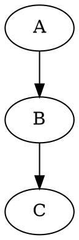
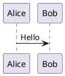

# Extended Markdown Features Test File

This file tests extended markdown syntax beyond CommonMark/GFM.

---

## Attributes and IDs

### Heading Attributes

## Heading with ID {#custom-heading-id}

## Heading with Class {.custom-class}

## Heading with Both {#my-id .my-class}

## Heading with Multiple Classes {.class1 .class2 .class3}

## Heading with Data Attribute {data-custom="value"}

### Block Attributes

{#paragraph-id .highlight}
This paragraph has an ID and class.

{.note .important data-priority="high"}
This paragraph has multiple attributes.

### Inline Attributes

This is [link with class](http://example.com){.external-link target="_blank"}.

This is **bold with class**{.highlight}.

This is `code with attributes`{.language-python}.

{width="300" height="200" .centered}

### Attribute Lists (Kramdown Style)

{: #kramdown-id .kramdown-class }
Paragraph with Kramdown-style attributes.

| Header |
|--------|
| Cell   |
{: .my-table #table-id }

### Fenced Code Attributes

```python {#code-id .highlight linenos=true hl_lines="2-4"}
def example():
    important = True
    also_important = True
    highlighted = True
    not_highlighted = False
```

```{.javascript caption="Example Code" startLine=10}
function example() {
    return true;
}
```

---

## Definition Lists

Term 1
:   Definition 1 with inline elements like **bold** and *italic*.

Term 2
:   Definition 2a
:   Definition 2b (multiple definitions)

Term 3
:   Definition with code block:
    
    ```python
    def example():
        pass
    ```

Term 4 with `code`
:   Definition for term with code.

**Bold Term**
:   Definition for bold term.

*Italic Term*
:   Definition for italic term.

### Nested Definition Lists

Outer Term
:   Outer Definition
    
    Inner Term
    :   Inner Definition

### Compact vs Loose

Tight definitions:
Term 1
: Def 1
Term 2
: Def 2
Term 3
: Def 3

Loose definitions:

Term 1
: Def 1

Term 2
: Def 2

Term 3
: Def 3

---

## Footnotes

### Basic Footnotes

Here is a simple footnote[^1].

Here is a footnote with a label[^label].

[^1]: This is the footnote content.

[^label]: This is a labeled footnote.

### Multi-Paragraph Footnotes

Here is a complex footnote[^complex].

[^complex]: This is the first paragraph of the footnote.

    This is the second paragraph, indented to continue the footnote.
    
    - Even lists work
    - Inside footnotes
    
    ```
    And code blocks too
    ```

### Inline Footnotes

Here is an inline footnote^[This is the inline footnote content, no separate definition needed.].

### Repeated References

This references footnote 1 again[^1].

### Footnotes in Various Contexts

| Column A | Column B |
|----------|----------|
| Cell[^table-fn] | Data |

[^table-fn]: Footnote from a table cell.

- List item with footnote[^list-fn]
- Another item

[^list-fn]: Footnote from a list.

> Blockquote with footnote[^quote-fn]

[^quote-fn]: Footnote from a blockquote.

---

## Superscript and Subscript

### Caret Syntax

X^2^ (superscript with carets)

H~2~O (subscript with tildes)

E = mc^2^

CO~2~ emissions

x^y+z^ (multi-character superscript)

a~i,j~ (multi-character subscript)

### Nested

x^2^~i~ (super then sub)

x~i~^2^ (sub then super)

### In Context

The formula is x^2^ + y^2^ = z^2^.

Water (H~2~O) is essential.

The 1^st^, 2^nd^, and 3^rd^ items.

### Edge Cases

2^10^ = 1024

10^-3^ = 0.001

a^b^c^^ (nested - might not work everywhere)

---

## Highlight / Mark

==This text is highlighted==

This sentence has ==highlighted words== in the middle.

==Multiple words can be highlighted together==

==Highlight with **bold** inside==

**Bold with ==highlight== inside**

`Code` and ==highlight== side by side.

### Edge Cases

====Double equals====

== Not highlighted (spaces) ==

==Across
lines==

---

## Abbreviations

The HTML specification is maintained by the W3C.

Using CSS and JS for web development.

Multiple abbrs: HTML, CSS, JS, W3C.

Repeated: HTML is HTML and always will be HTML.

*[HTML]: Hypertext Markup Language
*[CSS]: Cascading Style Sheets
*[JS]: JavaScript
*[W3C]: World Wide Web Consortium

### Case Sensitivity

html should not match (lowercase).

HTML should match (uppercase).

### Partial Word

HTMLS should not match (extra character).

### Punctuation

HTML. HTML, HTML! HTML? (HTML) [HTML]

---

## Smart Typography

### Smart Quotes

"Double quotes" become smart quotes.

'Single quotes' become smart too.

"Nested 'quotes' within" doubles.

'Nested "quotes" within' singles.

"It's working!" with apostrophe.

He said, "She said, 'Hello.'"

### Apostrophes

It's a beautiful day.

Don't worry, be happy.

The '90s were great.

Rock 'n' roll.

Fish 'n' chips.

### Dashes

En-dash: pages 1--10

Em-dash: Wait---what happened?

Multiple em-dashes: What---oh no---happened?

Hyphen-minus: self-aware (not converted)

### Ellipsis

Wait for it...

Trailing off.....

### Fractions

1/2 1/3 1/4 2/3 3/4 1/5 2/5 3/5 4/5 1/6 5/6 1/8 3/8 5/8 7/8

Not fractions: 1/10, 5/7, 11/12

### Mathematical Symbols

+- becomes ±

-+ becomes ∓

!= becomes ≠ (sometimes)

<= becomes ≤ (sometimes)

>= becomes ≥ (sometimes)

<< becomes « (sometimes)

>> becomes » (sometimes)

... becomes …

### Trademark Symbols

(c) becomes ©

(C) becomes ©

(r) becomes ®

(R) becomes ®

(tm) becomes ™

(TM) becomes ™

(p) becomes ℗

### Arrows

-> becomes →

<- becomes ←

<-> becomes ↔

=> becomes ⇒

<= becomes ⇐ (or ≤?)

### Currency

$100 (dollar)

€50 (euro)

£30 (pound)

¥1000 (yen)

### Math

x^2 for squared

x * y for multiplication

1/2 for fraction

+/- for plus or minus

---

## Table Extensions

### Column Spanning (Extended)

| Header 1 | Header 2 | Header 3 |
|----------|----------|----------|
| Spans 2  ||          |
| A        | B        | C        |
| D        || Spans 2  |

### Row Spanning (Extended)

| Header 1 | Header 2 |
|----------|----------|
| Row 1    | Spans    |
| Row 2    | ^        |
| Row 3    | End      |

### Captions

| Header 1 | Header 2 |
|----------|----------|
| Cell     | Cell     |

Table: This is the table caption.

| Header 1 | Header 2 |
|----------|----------|
| Cell     | Cell     |
: Another caption style

### Multi-line Cells

| Header 1 | Header 2 |
|----------|----------|
| Line 1   | Cell     |
  Line 2   |          |
| Normal   | Cell     |

### Table Without Headers

|----------|----------|
| Cell A   | Cell B   |
| Cell C   | Cell D   |

### Nested Tables (rarely supported)

| Outer | Table |
|-------|-------|
| A     | | Inner | |
|       | |-------|  |
|       | | Cell  |  |

---

## Math Delimiters

### Dollar Signs

Inline: $E = mc^2$

Display:
$$
\int_{-\infty}^{\infty} e^{-x^2} dx = \sqrt{\pi}
$$

### Backslash Parentheses

Inline: \(E = mc^2\)

Display:
\[
\sum_{n=1}^{\infty} \frac{1}{n^2} = \frac{\pi^2}{6}
\]

### Backslash Brackets

Display only:
\[
\nabla \cdot \vec{E} = \frac{\rho}{\epsilon_0}
\]

### Environments

\begin{equation}
x = \frac{-b \pm \sqrt{b^2 - 4ac}}{2a}
\end{equation}

\begin{align}
a &= b + c \\
d &= e + f
\end{align}

### Edge Cases

Price: $100 (not math - plain dollar)

Temperature: 20° C

Escaping: \$not math\$

Adjacent: $x$$y$

Empty: $$

---

## Task List Extensions

### Nested Task Lists

- [ ] Parent task
  - [ ] Child task 1
  - [x] Child task 2
    - [ ] Grandchild task
  - [ ] Child task 3

### Mixed Lists

1. [ ] Ordered unchecked
2. [x] Ordered checked
3. [ ] Ordered unchecked

- Regular bullet
- [ ] Task item
- Regular bullet
- [x] Checked task

### Task with Content

- [ ] Task with code: `npm install`
- [x] Task with **bold** and *italic*
- [ ] Task with [link](http://example.com)

### Alternative Checkboxes (Extended)

- [ ] Unchecked
- [x] Checked
- [X] Also checked (capital)
- [-] Cancelled/removed
- [>] Forwarded
- [<] Scheduled
- [?] Question
- [!] Important
- [*] Star
- ["] Quote
- [l] Location
- [b] Bookmark
- [i] Information
- [S] Savings
- [I] Idea
- [p] Pros
- [c] Cons
- [f] Fire
- [k] Key
- [w] Win
- [u] Up
- [d] Down

---

## Insert and Delete (Diff)

### Insert

++Inserted text++

{++Also inserted++}

### Delete

~~Deleted text~~ (strikethrough)

{--Actually deleted--}

### Combined

{~~Old text~>New text~~}

This was {--removed--} and this was {++added++}.

### Mark

{==Marked text==}

{>>Comment/annotation<<}

### Critic Markup

This is {++inserted++} text.

This is {--deleted--} text.

This is {~~old~>new~~} text (substitution).

This is {==highlighted==}{>>with a comment<<} text.

---

## Auto-Linking

### URLs

https://example.com

http://example.com

ftp://files.example.com/file.txt

file:///path/to/file

### Email

user@example.com

mailto:user@example.com

### Mentions (GitHub-style)

@username

@organization/team

### Issues/PRs (GitHub-style)

#123

user/repo#123

GH-123

### Commits (GitHub-style)

abc1234

user/repo@abc1234

### Paths

./relative/path

../parent/path

/absolute/path

~/home/path

### Special URLs

tel:+1-555-555-5555

sms:+1-555-555-5555

geo:40.7128,-74.0060

magnet:?xt=urn:btih:...

---

## Include Directives

### Various Include Syntaxes

@include "./file.md"



{{#include ./file.md}}

{}

\input{file.tex}

<!--#include file="file.html" -->

<include src="file.md" />

### Line Ranges

{{#include ./file.md:5:10}}

{{#include ./file.md:5:}}

{{#include ./file.md::10}}

### Anchors

{{#include ./file.md:anchor_name}}

{{#include ./file.md#section}}

---

## Emoji

### Shortcodes

:smile: :laugh: :grin: :joy: :rofl:

:heart: :heart_eyes: :kissing_heart: :two_hearts:

:thumbsup: :thumbsdown: :clap: :wave: :raised_hands:

:rocket: :star: :sparkles: :fire: :zap:

:warning: :no_entry: :x: :white_check_mark: :heavy_check_mark:

:question: :exclamation: :information_source: :bulb: :memo:

:calendar: :clock: :email: :phone: :computer:

:+1: :-1: :100: :1234:

### Country Flags

:us: :gb: :fr: :de: :jp: :cn: :kr: :it: :es: :br:

### Custom/Platform Specific

:octocat: (GitHub)

:shipit: (GitHub)

### Unicode Emoji

😀 😁 😂 🤣 😃 😄 😅 😆 😉 😊

❤️ 🧡 💛 💚 💙 💜 🖤 🤍 🤎 💔

👍 👎 👏 🙌 🤝 🙏 💪 🤙 🖐️ ✋

🚀 ⭐ ✨ 🔥 ⚡ 💥 💫 🌟 ⚠️ 🚫

---

## Miscellaneous Extended Features

### Keyboard Keys

<kbd>Ctrl</kbd> + <kbd>C</kbd>

<kbd>Cmd</kbd> + <kbd>Shift</kbd> + <kbd>P</kbd>

[[Ctrl]] + [[C]] (alternate syntax)

### Ruby Annotations (for Asian languages)

<ruby>漢字<rt>かんじ</rt></ruby>

{漢字}(かんじ)

### Spoilers

||This is a spoiler||

>! This is also a spoiler

<details>
<summary>Spoiler</summary>
Hidden content here.
</details>

### Timestamps

<t:1234567890:F>

<t:1234567890:R>

### Variables/Placeholders

${variable}

{{variable}}

{}

{{ .Variable }}

<%= variable %>

${env:HOME}

### Comments

<!-- HTML comment -->

[//]: # (Reference-style comment)

[comment]: # (Another comment)

% LaTeX-style comment

// Line comment (in some systems)

/* Block comment (in some systems) */

{# Jinja comment #}

### Line Numbers

```python {linenos=true}
def hello():
    print("Hello")
```

```python {startLine=100}
# This starts at line 100
def example():
    pass
```

### Diagrams in Code Blocks





### Raw/Verbatim

```{=html}
<div class="raw-html">This is raw HTML output</div>
```

```{=latex}
\textbf{Raw LaTeX}
```

### Page Breaks

<div style="page-break-after: always;"></div>

\newpage

\pagebreak

---

---

---

### Horizontal Rules Variations

***

---

___

* * *

- - -

_ _ _

*****

-----

_____

### Escape Sequences

\\ backslash

\` backtick

\* asterisk

\_ underscore

\{ \} braces

\[ \] brackets

\( \) parentheses

\# hash

\+ plus

\- minus

\. dot

\! exclamation

\| pipe

---

## End of Extended Features Test File
