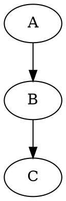
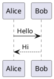

# mdbook-Specific Features Test File

This file tests features specific to mdbook and its preprocessors.

---

## File Includes

### Basic Include

The following includes an entire file:

{{#include ./sample-include.md}}

### Include with Anchor

Include only a specific section marked with anchors:

{{#include ./sample-code.rs:main}}

### Include Line Range

Include specific lines:

{{#include ./sample-code.rs:5:10}}

### Include from Line to End

{{#include ./sample-code.rs:15:}}

### Include from Start to Line

{{#include ./sample-code.rs::20}}

### Rustdoc Include

For Rust code with hidden lines:

{{#rustdoc_include ./sample-code.rs:example}}

### Playground

Interactive Rust playground:

{{#playground ./sample-code.rs}}

{{#playground ./sample-code.rs editable}}

{{#playground ./sample-code.rs hidden}}

---

## Title Override

{{#title Custom Page Title for This Chapter}}

---

## Template Variables

{{#template ./templates/note.md message="This is a templated note"}}

{{#template ./templates/warning.md
    title="Important Warning"
    content="This is the warning content."
}}

---

## TOML Frontmatter

```toml
+++
title = "Page Title"
description = "Page description for SEO"
authors = ["Author Name"]
date = 2024-01-15
draft = false
[extra]
custom_field = "value"
+++
```

---

## Chapter Links

### Relative Links

Link to [another chapter](./another-chapter.md).

Link to [parent chapter](../parent/chapter.md).

Link to [specific section](./chapter.md#section-heading).

### Root-Relative Links

Link from root: [Chapter One](/chapter-one/index.md)

---

## Search and Index

### Hiding from Search

<!-- mdbook-exclude -->
This content is excluded from search indexing.
<!-- /mdbook-exclude -->

### Search Keywords

<!-- Keywords: rust, programming, tutorial -->

---

## Preprocessor Directives

### Conditional Content

<!-- #if feature="advanced" -->
This content only appears when the "advanced" feature is enabled.
<!-- #endif -->

<!-- #if NOT(feature="basic") -->
This appears when "basic" feature is NOT enabled.
<!-- #endif -->

---

## Code Annotations

### Rust-Specific Features

```rust,ignore
// This code is not tested
fn example() {
    unimplemented!()
}
```

```rust,should_panic
fn panics() {
    panic!("This should panic!");
}
```

```rust,no_run
fn main() {
    // Compiled but not executed
    dangerous_operation();
}
```

```rust,compile_fail
fn main() {
    // This should fail to compile
    let x: i32 = "not a number";
}
```

```rust,edition2021
// Rust 2021 edition code
fn main() {
    let array = [1, 2, 3];
    for i in array {
        println!("{}", i);
    }
}
```

### Editable Code Blocks

```rust,editable
fn main() {
    // Users can edit this code
    println!("Edit me!");
}
```

### Hidden Lines

```rust
# // Hidden setup code (line starts with #)
# fn setup() {}
fn main() {
    // Visible code
    println!("Hello!");
}
# // Hidden teardown
# fn teardown() {}
```

### Line Numbers

```rust,linenos
fn main() {
    let a = 1;
    let b = 2;
    let c = a + b;
    println!("{}", c);
}
```

### Highlighting Lines

```rust,hl_lines=2 4-6
fn main() {
    let important = true;  // highlighted
    let normal = false;
    let also = "highlighted";  // highlighted
    let these = "lines";       // highlighted
    let too = "!";             // highlighted
    let not_this = "one";
}
```

---

## Theme and Styling

### Custom CSS Classes

<div class="warning">
This is a warning box using custom CSS.
</div>

<div class="info">
This is an info box.
</div>

<div class="ferris-explains">
Ferris the crab explains something here.
</div>

---

## Interactive Elements

### Runnable Examples (with mdbook-keeper or similar)

```rust,runnable
fn main() {
    println!("This can be run in the browser!");
}
```

### Quiz Elements (with mdbook-quiz)

{{#quiz ./quizzes/chapter1.toml}}

---

## Table of Contents Control

### Manual TOC

<!-- toc -->

### Disable TOC for Section

<!-- no-toc -->

---

## Print-Specific

### Page Break

<div style="page-break-after: always;"></div>

### Print-Only Content

<div class="print-only">
This only appears in print/PDF output.
</div>

### Screen-Only Content

<div class="screen-only">
This only appears on screen, not in print.
</div>

---

## Internationalization (i18n)

### Language-Specific Content

<!-- i18n:en -->
English content here.
<!-- /i18n:en -->

<!-- i18n:es -->
Contenido en español aquí.
<!-- /i18n:es -->

### Translation Markers

<!-- i18n-ignore -->
This text should not be translated.
<!-- /i18n-ignore -->

---

## Preprocessor-Specific

### mdbook-admonish

```admonish warning
This is a warning admonition.
```

```admonish info title="Custom Title"
Info with a custom title.
```

```admonish danger
Danger zone!
```

```admonish tip
Here's a helpful tip.
```

```admonish note
Just a note.
```

```admonish example
An example admonition.
```

```admonish quote
A quote admonition.
```

### mdbook-toc

<!-- Insert table of contents -->
<!-- toc -->

### mdbook-linkcheck

<!-- linkcheck-disable -->
[This broken link won't be checked](http://broken.invalid)
<!-- linkcheck-enable -->

### mdbook-mermaid

See diagrams test file.

### mdbook-katex

See KaTeX test file.

### mdbook-graphviz



### mdbook-plantuml



### mdbook-cmdrun

Running a command and including output:

<!-- cmdrun echo "Hello from command" -->

### mdbook-footnote

Standard footnotes work.[^1]

[^1]: Footnote content.

### mdbook-variables

Using variables: {{book.title}} by {{book.authors}}

### mdbook-last-changed

Last updated: {{#include ./LAST_CHANGED}}

---

## Book Configuration References

### book.toml Values

- Title: `{{book.title}}`
- Authors: `{{book.authors}}`  
- Description: `{{book.description}}`
- Source directory: `{{book.src}}`
- Language: `{{book.language}}`

### Environment Variables

Build directory: `{{env.MDBOOK_BUILD_DIR}}`

---

## Output-Specific Features

### HTML Output Only

<!-- HTML output only -->
<script>
console.log("This only runs in HTML output");
</script>

### Epub Specific

<!-- epub:start -->
Content specific to epub output.
<!-- epub:end -->

### PDF Specific

<!-- pdf:start -->
Content specific to PDF output.
<!-- pdf:end -->

---

## Debugging and Development

### Draft Content

<!-- draft -->
This is draft content that may be hidden in production.
<!-- /draft -->

### TODO Markers

<!-- TODO: Complete this section -->

<!-- FIXME: Fix the broken example -->

<!-- NOTE: Remember to update this -->

### Version Markers

<!-- version:1.0.0 -->
Content added in version 1.0.0.
<!-- /version -->

<!-- deprecated:2.0.0 -->
This feature is deprecated as of version 2.0.0.
<!-- /deprecated -->

---

## Summary and Navigation

### SUMMARY.md Structure Reference

```markdown
# Summary

[Introduction](./intro.md)

# Part 1

- [Chapter 1](./ch1/index.md)
  - [Section 1.1](./ch1/section1.md)
  - [Section 1.2](./ch1/section2.md)
- [Chapter 2](./ch2.md)

# Part 2

- [Chapter 3](./ch3.md)

---

[Appendix A](./appendix-a.md)
[Contributors](./contributors.md)

---

[Changelog](./changelog.md)
```

### Navigation Separators

Horizontal rules in SUMMARY.md create navigation separators.

### Draft Chapters

```markdown
- [Draft Chapter]()
```

### Prefix and Suffix Chapters

Prefix chapters appear before numbered chapters.
Suffix chapters appear after (like appendices).

---

## End of mdbook Features Test File
