# Mermaid Diagrams Test File

This file tests all Mermaid diagram types and features.

---

## Flowcharts

### Basic Flowchart

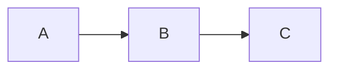

### Direction Variants

Top to Bottom:
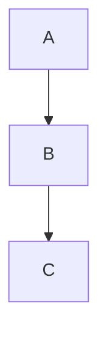

Bottom to Top:
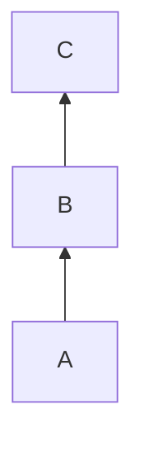

Left to Right:


Right to Left:
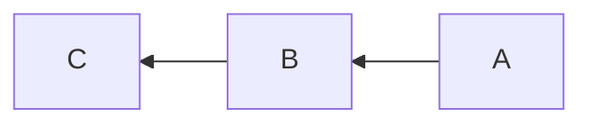

### Node Shapes

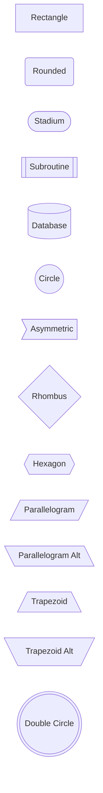

### Link Types

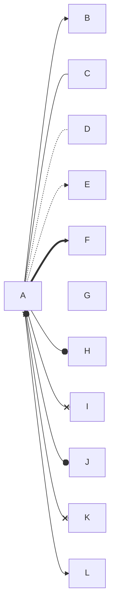

### Link Labels

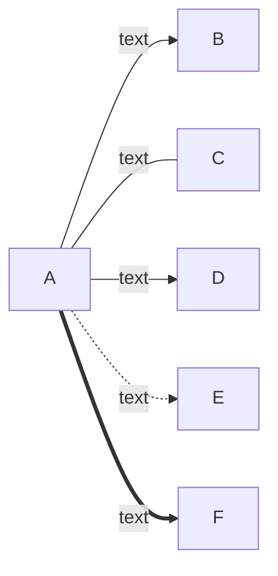

### Link Length

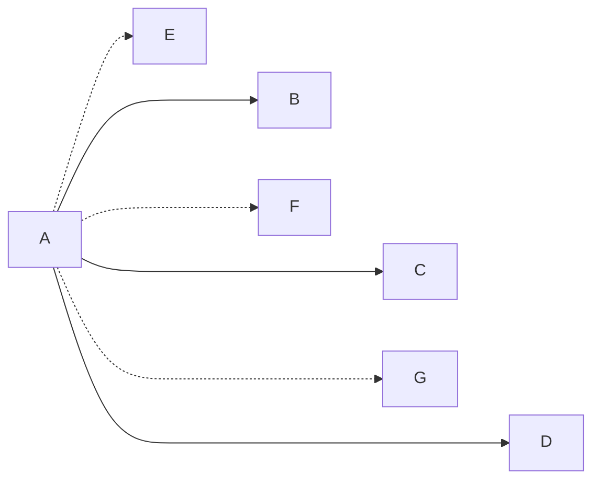

### Subgraphs

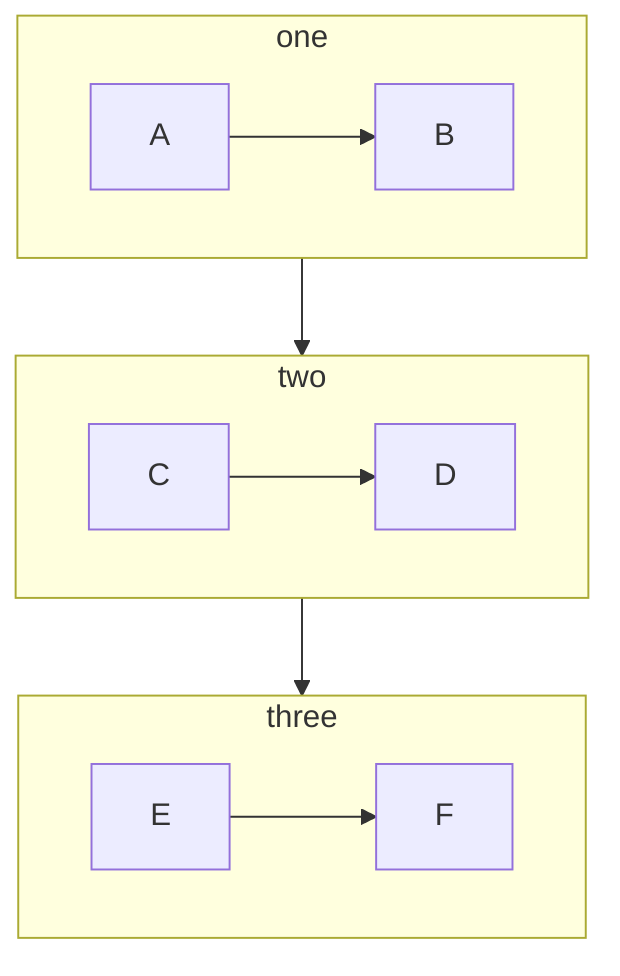

### Nested Subgraphs

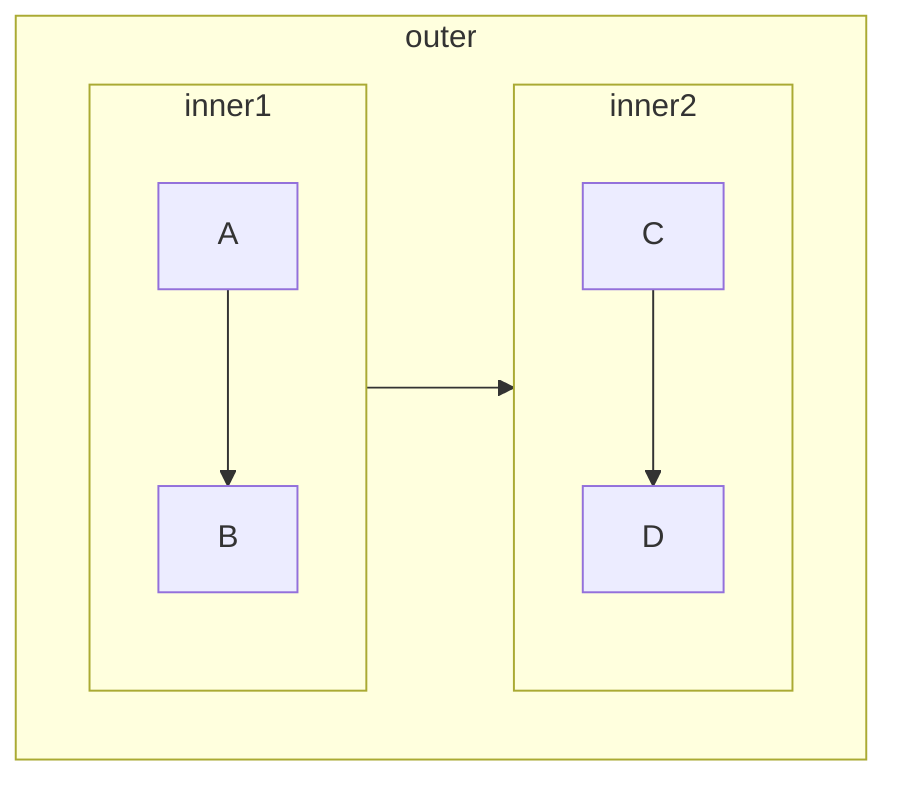

### Subgraph Direction

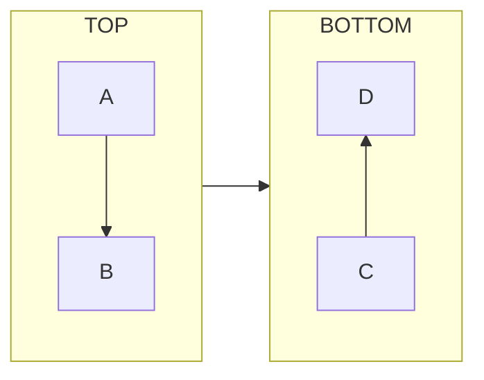

### Styling Nodes

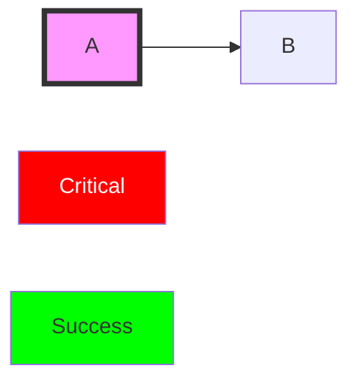

### Styling Links

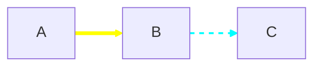

### Click Events and Links

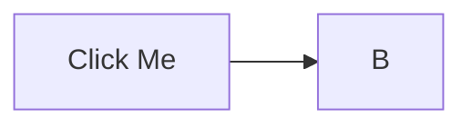

### Icons and Font Awesome

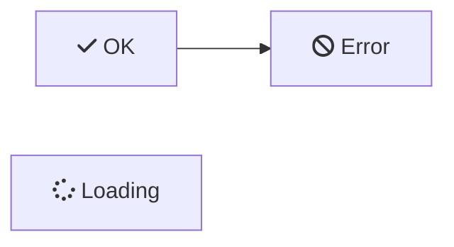

### Special Characters

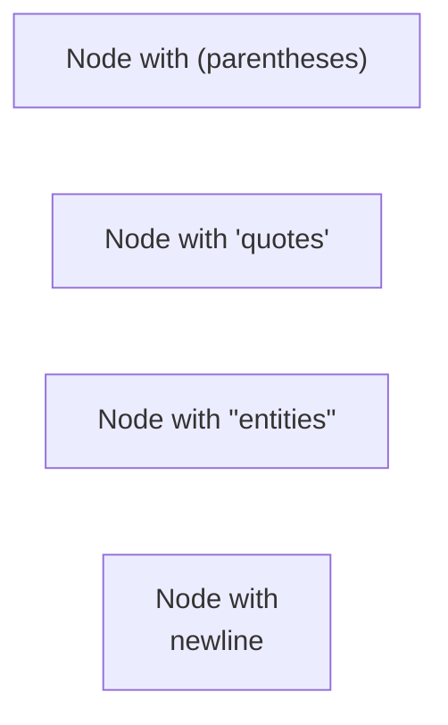

### Complex Example

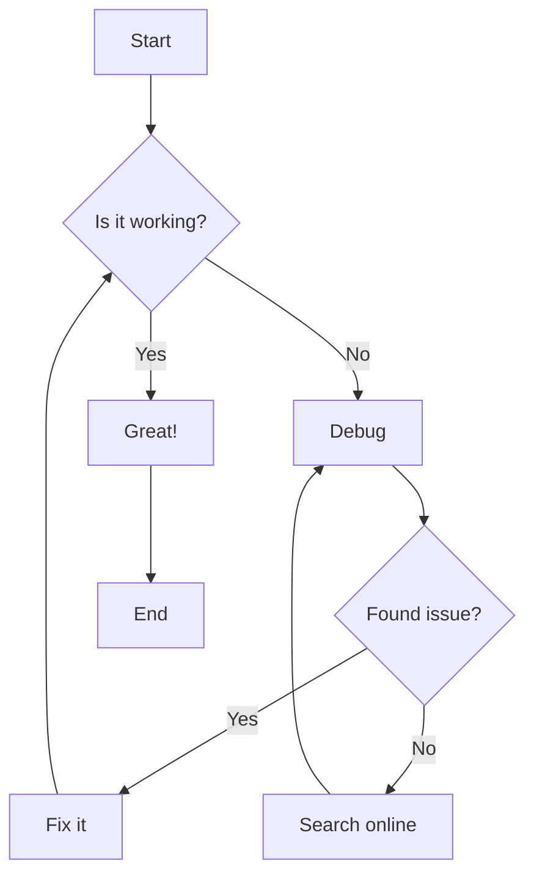

---

## Sequence Diagrams

### Basic Sequence

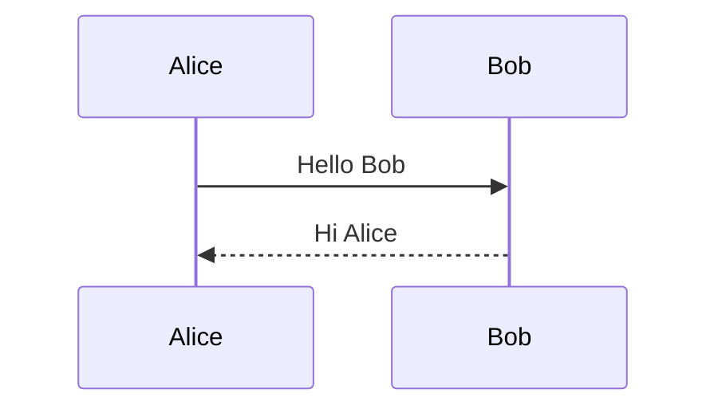

### Participants

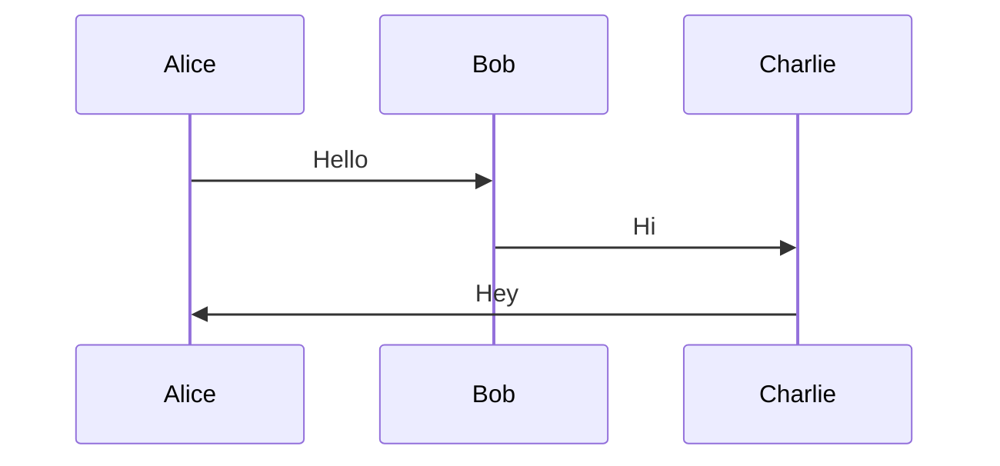

### Actors

```mermaid
sequenceDiagram
    actor User
    participant System
    User->>System: Request
    System-->>User: Response
```

### Arrow Types

```mermaid
sequenceDiagram
    A->B: Solid line without arrow
    A-->B: Dotted line without arrow
    A->>B: Solid line with arrow
    A-->>B: Dotted line with arrow
    A-xB: Solid line with cross
    A--xB: Dotted line with cross
    A-)B: Solid line with open arrow
    A--)B: Dotted line with open arrow
```

### Activations

```mermaid
sequenceDiagram
    Alice->>+John: Hello John
    John-->>-Alice: Hi Alice
    
    Alice->>+John: Another message
    John->>+Jane: Nested activation
    Jane-->>-John: Response
    John-->>-Alice: Done
```

### Notes

```mermaid
sequenceDiagram
    Alice->>Bob: Hello
    Note right of Bob: Bob thinks
    Note left of Alice: Alice waits
    Note over Alice,Bob: Both involved
```

### Loops

```mermaid
sequenceDiagram
    Alice->>Bob: Hello
    loop Every minute
        Bob->>Alice: Ping
    end
```

### Alt/Opt/Par

```mermaid
sequenceDiagram
    Alice->>Bob: Request
    alt Success
        Bob->>Alice: OK
    else Failure
        Bob->>Alice: Error
    end
    
    opt Optional
        Alice->>Bob: Thanks
    end
```

```mermaid
sequenceDiagram
    par Alice to Bob
        Alice->>Bob: Hello
    and Alice to John
        Alice->>John: Hello
    end
    Bob-->>Alice: Hi
    John-->>Alice: Hi
```

### Critical Regions

```mermaid
sequenceDiagram
    critical Establish connection
        Service->>DB: Connect
    option Network timeout
        Service-->Service: Retry
    option Connection refused
        Service-->Service: Use fallback
    end
```

### Break

```mermaid
sequenceDiagram
    Consumer->>API: Request
    API->>DB: Query
    break When query fails
        API->>Consumer: Error response
    end
    DB->>API: Result
    API->>Consumer: Success response
```

### Rect (Background)

```mermaid
sequenceDiagram
    rect rgb(200, 220, 255)
        Alice->>Bob: Request
        Bob->>Alice: Response
    end
```

### Autonumber

```mermaid
sequenceDiagram
    autonumber
    Alice->>Bob: First
    Bob->>Alice: Second
    Alice->>Bob: Third
```

### Comments

```mermaid
sequenceDiagram
    Alice->>Bob: Hello
    %% This is a comment
    Bob->>Alice: Hi
```

---

## Class Diagrams

### Basic Class

```mermaid
classDiagram
    class Animal {
        +String name
        +int age
        +makeSound()
    }
```

### Visibility

```mermaid
classDiagram
    class Example {
        +publicField
        -privateField
        #protectedField
        ~packageField
        +publicMethod()
        -privateMethod()
    }
```

### Relationships

```mermaid
classDiagram
    classA <|-- classB : Inheritance
    classC *-- classD : Composition
    classE o-- classF : Aggregation
    classG <-- classH : Association
    classI -- classJ : Link (solid)
    classK <.. classL : Dependency
    classM <|.. classN : Realization
    classO .. classP : Link (dashed)
```

### Cardinality

```mermaid
classDiagram
    Customer "1" --> "*" Order
    Order "*" --> "1..*" LineItem
    Student "0..*" --> "1..*" Course
```

### Annotations

```mermaid
classDiagram
    class Shape
    <<interface>> Shape
    
    class Color
    <<enumeration>> Color
    
    class Singleton
    <<service>> Singleton
    
    class Utility
    <<abstract>> Utility
```

### Generic Types

```mermaid
classDiagram
    class List~T~ {
        +add(T item)
        +get(int index) T
    }
    
    class Map~K,V~ {
        +put(K key, V value)
        +get(K key) V
    }
```

### Namespace

```mermaid
classDiagram
    namespace Animals {
        class Dog
        class Cat
    }
    namespace Vehicles {
        class Car
        class Bike
    }
```

### Complete Example

```mermaid
classDiagram
    Animal <|-- Duck
    Animal <|-- Fish
    Animal <|-- Zebra
    Animal : +int age
    Animal : +String gender
    Animal: +isMammal()
    Animal: +mate()
    class Duck{
        +String beakColor
        +swim()
        +quack()
    }
    class Fish{
        -int sizeInFeet
        -canEat()
    }
    class Zebra{
        +bool is_wild
        +run()
    }
```

---

## State Diagrams

### Basic State

```mermaid
stateDiagram-v2
    [*] --> Still
    Still --> Moving
    Moving --> Still
    Moving --> [*]
```

### State Descriptions

```mermaid
stateDiagram-v2
    state "Long State Name" as s1
    [*] --> s1
    s1 --> [*]
```

### Transitions

```mermaid
stateDiagram-v2
    s1 --> s2 : Event/Action
    s2 --> s3 : Condition [guard]
```

### Composite States

```mermaid
stateDiagram-v2
    [*] --> First
    First --> Second
    
    state First {
        [*] --> fir
        fir --> [*]
    }
    
    state Second {
        [*] --> sec
        sec --> [*]
    }
```

### Choice

```mermaid
stateDiagram-v2
    state if_state <<choice>>
    [*] --> IsPositive
    IsPositive --> if_state
    if_state --> False : if n < 0
    if_state --> True : if n >= 0
```

### Fork and Join

```mermaid
stateDiagram-v2
    state fork_state <<fork>>
    state join_state <<join>>
    
    [*] --> fork_state
    fork_state --> State2
    fork_state --> State3
    
    State2 --> join_state
    State3 --> join_state
    join_state --> State4
    State4 --> [*]
```

### Notes

```mermaid
stateDiagram-v2
    State1 : Description
    note right of State1
        Important info
    end note
    note left of State2 : Quick note
```

### Concurrency

```mermaid
stateDiagram-v2
    [*] --> Active
    
    state Active {
        [*] --> NumLock
        --
        [*] --> CapsLock
        --
        [*] --> ScrollLock
    }
```

### Direction

```mermaid
stateDiagram-v2
    direction LR
    [*] --> A --> B --> C --> [*]
```

---

## Entity Relationship Diagrams

### Basic ER

```mermaid
erDiagram
    CUSTOMER ||--o{ ORDER : places
    ORDER ||--|{ LINE_ITEM : contains
    CUSTOMER }|..|{ DELIVERY_ADDRESS : uses
```

### Relationship Types

```mermaid
erDiagram
    A ||--|| B : one-to-one
    C ||--o{ D : one-to-zero-or-more
    E ||--|{ F : one-to-one-or-more
    G }o--o{ H : zero-or-more-to-zero-or-more
```

### Attributes

```mermaid
erDiagram
    CUSTOMER {
        string name
        string email PK
        int age
    }
    ORDER {
        int id PK
        string status
        date created_at
    }
    CUSTOMER ||--o{ ORDER : places
```

### Attribute Keys

```mermaid
erDiagram
    USER {
        int id PK
        string email UK
        int department_id FK
        string name
    }
```

### Comments

```mermaid
erDiagram
    USER {
        int id PK "Primary identifier"
        string email UK "Must be unique"
    }
```

### Complete Example

```mermaid
erDiagram
    CUSTOMER ||--o{ ORDER : places
    CUSTOMER {
        string id PK
        string name
        string email UK
    }
    ORDER ||--|{ ORDER_ITEM : contains
    ORDER {
        string id PK
        date created_at
        string status
        string customer_id FK
    }
    PRODUCT ||--o{ ORDER_ITEM : "ordered in"
    PRODUCT {
        string id PK
        string name
        decimal price
    }
    ORDER_ITEM {
        string order_id FK
        string product_id FK
        int quantity
    }
```

---

## Gantt Charts

### Basic Gantt

```mermaid
gantt
    title Project Schedule
    dateFormat  YYYY-MM-DD
    
    section Planning
    Research           :a1, 2024-01-01, 30d
    Requirements       :after a1, 20d
    
    section Development
    Design             :2024-02-01, 25d
    Implementation     :2024-02-15, 60d
```

### Task Status

```mermaid
gantt
    title Task Status Example
    dateFormat  YYYY-MM-DD
    
    section Tasks
    Completed task     :done,    t1, 2024-01-01, 10d
    Active task        :active,  t2, 2024-01-11, 10d
    Future task        :         t3, after t2, 10d
    Critical task      :crit,    t4, 2024-01-15, 5d
    Milestone          :milestone, m1, 2024-01-20, 0d
```

### Dependencies

```mermaid
gantt
    title Dependencies
    dateFormat YYYY-MM-DD
    
    Task A :a, 2024-01-01, 7d
    Task B :b, after a, 5d
    Task C :c, after a, 3d
    Task D :d, after b c, 4d
```

### Sections and Exclusions

```mermaid
gantt
    title Project with Exclusions
    dateFormat YYYY-MM-DD
    excludes weekends
    
    section Phase 1
    Task 1 :2024-01-01, 10d
    Task 2 :5d
    
    section Phase 2
    Task 3 :2024-01-20, 7d
```

### Time Formats

```mermaid
gantt
    title Hourly Granularity
    dateFormat HH:mm
    axisFormat %H:%M
    
    section Morning
    Standup     :09:00, 30m
    Development :09:30, 3h
    Review      :12:30, 1h
```

---

## Pie Charts

### Basic Pie

```mermaid
pie
    title Browser Market Share
    "Chrome" : 65
    "Firefox" : 15
    "Safari" : 12
    "Edge" : 5
    "Other" : 3
```

### With ShowData

```mermaid
pie showData
    title Pet Ownership
    "Dogs" : 45
    "Cats" : 30
    "Fish" : 15
    "Birds" : 10
```

---

## Quadrant Charts

```mermaid
quadrantChart
    title Reach vs Engagement
    x-axis Low Reach --> High Reach
    y-axis Low Engagement --> High Engagement
    quadrant-1 We should expand
    quadrant-2 Need to promote
    quadrant-3 Re-evaluate
    quadrant-4 May be improved
    Campaign A: [0.3, 0.6]
    Campaign B: [0.45, 0.23]
    Campaign C: [0.57, 0.69]
    Campaign D: [0.78, 0.34]
    Campaign E: [0.40, 0.34]
    Campaign F: [0.35, 0.78]
```

---

## Requirement Diagrams

```mermaid
requirementDiagram
    requirement test_req {
        id: 1
        text: The system shall do X
        risk: high
        verifyMethod: test
    }
    
    functionalRequirement test_req2 {
        id: 1.1
        text: The system shall do Y
        risk: medium
        verifyMethod: inspection
    }
    
    performanceRequirement test_req3 {
        id: 1.2
        text: Response time < 1s
        risk: low
        verifyMethod: demonstration
    }
    
    element test_entity {
        type: simulation
    }
    
    test_entity - satisfies -> test_req
    test_req - contains -> test_req2
    test_req - contains -> test_req3
```

---

## Git Graphs

```mermaid
gitGraph
    commit
    commit
    branch develop
    checkout develop
    commit
    commit
    checkout main
    merge develop
    commit
    branch feature
    checkout feature
    commit
    commit
    checkout develop
    merge feature
    checkout main
    merge develop
    commit
```

### With Options

```mermaid
gitGraph
    options
    {
        "nodeSpacing": 150,
        "nodeRadius": 10
    }
    end
    commit
    branch hotfix
    checkout hotfix
    commit
    commit
    checkout main
    merge hotfix
    commit
    commit
```

---

## User Journey

```mermaid
journey
    title My Working Day
    section Go to work
        Make tea: 5: Me
        Go upstairs: 3: Me
        Do work: 1: Me, Cat
    section Go home
        Go downstairs: 5: Me
        Sit down: 5: Me
```

---

## Timeline

```mermaid
timeline
    title History of Technology
    section Stone Age
        3000 BC : Wheel invented
    section Bronze Age
        1500 BC : Iron smelting
    section Modern Era
        1876 : Telephone
        1903 : Airplane
        1969 : Moon landing
        2007 : iPhone
```

---

## Mind Maps

```mermaid
mindmap
    root((Central Topic))
        Branch 1
            Sub-branch 1a
            Sub-branch 1b
        Branch 2
            Sub-branch 2a
                Detail 2a1
                Detail 2a2
            Sub-branch 2b
        Branch 3
```

### Shapes in Mind Maps

```mermaid
mindmap
    root((Circle))
        Square[Square]
            Rounded(Rounded)
        Bang))Bang((
            Cloud)Cloud(
        Hexagon{{Hexagon}}
```

### Icons in Mind Maps

```mermaid
mindmap
    root((Project))
        ::icon(fa fa-book)
        Planning
            ::icon(fa fa-calendar)
        Development
            ::icon(fa fa-code)
        Testing
            ::icon(fa fa-bug)
```

---

## Sankey Diagrams

```mermaid
sankey-beta

Agricultural 'waste',Bio-conversion,124.729
Bio-conversion,Liquid,0.597
Bio-conversion,Losses,26.862
Bio-conversion,Solid,280.322
Bio-conversion,Gas,81.144
```

---

## XY Charts

```mermaid
xychart-beta
    title "Sales Revenue"
    x-axis [jan, feb, mar, apr, may, jun, jul, aug, sep, oct, nov, dec]
    y-axis "Revenue ($ in thousands)" 4000 --> 11000
    bar [5000, 6000, 7500, 8200, 9500, 10500, 11000, 10200, 9200, 8500, 7000, 6000]
    line [5000, 6000, 7500, 8200, 9500, 10500, 11000, 10200, 9200, 8500, 7000, 6000]
```

---

## Block Diagrams

```mermaid
block-beta
    columns 3
    a["Input"]:1
    b["Process"]:1
    c["Output"]:1
    
    a --> b --> c
```

```mermaid
block-beta
    columns 1
    db(("Database"))
    blockArrowId6<["&nbsp;&nbsp;&nbsp;"]>(down)
    block:e:3
        l["Web Server"]
        m["App Server"]
    end
```

---

## C4 Diagrams

### System Context

```mermaid
C4Context
    title System Context Diagram
    
    Person(customer, "Customer", "A customer of the bank")
    System(banking, "Banking System", "Handles all banking operations")
    System_Ext(email, "Email System", "External email provider")
    
    Rel(customer, banking, "Uses")
    Rel(banking, email, "Sends emails using")
```

### Container

```mermaid
C4Container
    title Container Diagram
    
    Person(customer, "Customer")
    
    Container_Boundary(c1, "Banking System") {
        Container(web, "Web App", "React", "Delivers content")
        Container(api, "API", "Java", "Business logic")
        ContainerDb(db, "Database", "PostgreSQL", "Stores data")
    }
    
    Rel(customer, web, "Uses", "HTTPS")
    Rel(web, api, "Calls", "JSON/HTTPS")
    Rel(api, db, "Reads/Writes", "SQL")
```

---

## ZenUML

```mermaid
zenuml
    title Order Service
    @Actor Client
    @Boundary OrderController
    @Service OrderService
    @Database OrderDB
    
    Client->OrderController.createOrder(items) {
        OrderController->OrderService.process(items) {
            OrderService->OrderDB.save(order)
            return order
        }
        return orderResponse
    }
```

---

## Theming and Configuration

### Theme

```mermaid
%%{init: {'theme': 'dark'}}%%
flowchart LR
    A --> B --> C
```

```mermaid
%%{init: {'theme': 'forest'}}%%
flowchart LR
    A --> B --> C
```

### Custom Theme Variables

```mermaid
%%{init: {'theme': 'base', 'themeVariables': { 'primaryColor': '#ff0000', 'edgeLabelBackground':'#ffffff'}}}%%
flowchart LR
    A[Red Node] --> B --> C
```

### Security Level

```mermaid
%%{init: {'securityLevel': 'loose'}}%%
flowchart LR
    A --> B
```

---

## Global Directives

### Log Level

```mermaid
%%{init: {'logLevel': 'debug'}}%%
flowchart LR
    A --> B
```

### Font Family

```mermaid
%%{init: {'flowchart': {'htmlLabels': false}, 'fontFamily': 'monospace'}}%%
flowchart LR
    A[Monospace] --> B[Font]
```

---

## Edge Cases

### Empty Diagram

```mermaid
flowchart LR
```

### Single Node

```mermaid
flowchart LR
    A
```

### Many Nodes

```mermaid
flowchart LR
    A --> B --> C --> D --> E --> F --> G --> H --> I --> J
```

### Unicode

```mermaid
flowchart LR
    A[日本語] --> B[中文]
    C[한국어] --> D[العربية]
    E[Ελληνικά] --> F[עברית]
```

### Special Characters

```mermaid
flowchart LR
    A["Node with #quot;quotes#quot;"]
    B["Node with 'apostrophes'"]
    C["Node with #amp; ampersand"]
    D["Node with #lt;angle#gt; brackets"]
```

---

## End of Mermaid Test File
