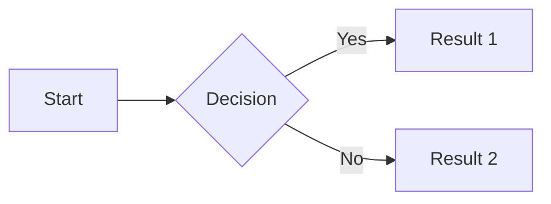
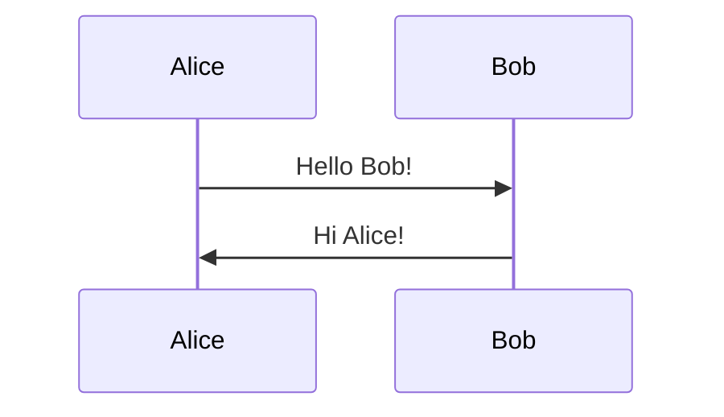
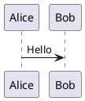
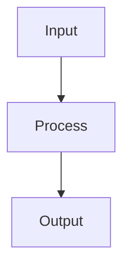
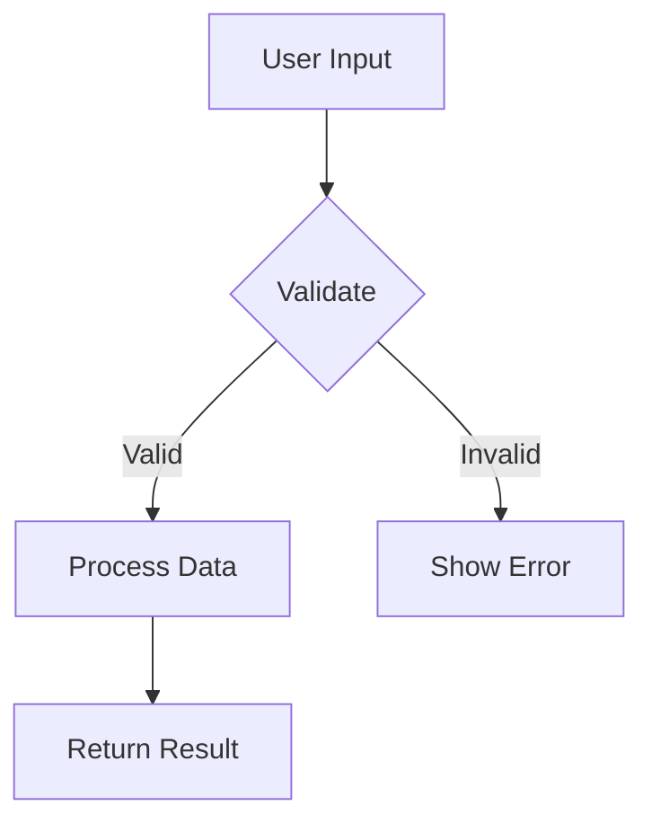

# MDBOOK010 - Invalid Preprocessor Configuration

**Severity**: Warning  
**Category**: mdBook-specific  
**Auto-fix**: Not available

## Rule Description

This rule validates preprocessor directives and configuration, including math blocks, mermaid diagrams, and other mdBook preprocessor syntax. It ensures proper formatting for preprocessor features.

## Why This Rule Exists

Valid preprocessor configuration is important because:
- Prevents build failures from malformed directives
- Ensures special content renders correctly
- Maintains compatibility with mdBook preprocessors
- Validates math notation and diagram syntax
- Helps identify configuration issues early

## Examples

### ❌ Incorrect (violates rule)

````markdown
<!-- Invalid math block syntax -->
$$
x = \frac{-b \pm \sqrt{b^2 - 4ac}{2a}  <!-- Missing closing brace -->
$$

<!-- Wrong delimiter -->
$$$
E = mc^2
$$$

<!-- Invalid mermaid block -->
```mermaid
graph LR
    A --> B  <!-- Missing semicolons in some cases -->
```

<!-- Malformed preprocessor directive -->
{{#math}}x^2{{/math}}  <!-- Wrong syntax -->
````

### ✅ Correct

````markdown
<!-- Valid inline math -->
When $a \ne 0$, there are two solutions

<!-- Valid math block -->
$$
x = \frac{-b \pm \sqrt{b^2 - 4ac}}{2a}
$$

<!-- Valid KaTeX block -->
```math
\int_{-\infty}^{\infty} e^{-x^2} dx = \sqrt{\pi}
```

<!-- Valid mermaid diagram -->

````

## Supported Preprocessors

### Math Rendering (mdbook-katex)

````markdown
<!-- Inline math -->
The equation $a^2 + b^2 = c^2$ is famous.

<!-- Block math with $$ -->
$$
\begin{aligned}
\nabla \cdot \vec{E} &= \frac{\rho}{\epsilon_0} \\
\nabla \cdot \vec{B} &= 0
\end{aligned}
$$

<!-- Block math with code fence -->
```math
\sum_{i=1}^{n} i = \frac{n(n+1)}{2}
```
````

### Mermaid Diagrams (mdbook-mermaid)

````markdown

````

### Other Common Preprocessors

````markdown
<!-- mdbook-admonish -->
```admonish warning
This is a warning message.
```

<!-- mdbook-toc -->
{{#toc}}

<!-- mdbook-plantuml -->

````

## Configuration

```toml
# book.toml - Preprocessor configuration
[preprocessor.katex]
after = ["links"]

[preprocessor.mermaid]
command = "mdbook-mermaid"

[preprocessor.admonish]
command = "mdbook-admonish"

# .mdbook-lint.toml - Rule configuration
[MDBOOK010]
check_math = true       # Validate math syntax (default: true)
check_mermaid = true    # Validate mermaid syntax (default: true)
allowed_preprocessors = ["katex", "mermaid", "admonish"]
```

## Common Issues and Solutions

### Issue: Math Not Rendering
```toml
# book.toml - Ensure preprocessor is installed
[preprocessor.katex]
```

```bash
# Install the preprocessor
cargo install mdbook-katex
```

### Issue: Delimiter Conflicts
````markdown
<!-- Problem: Dollar signs in code -->
```bash
echo "Price: $10"  # $ conflicts with math
```

<!-- Solution: Use code fence -->
```text
Price: $10
```

<!-- Or escape in inline code -->
The price is `$10` (literal dollar sign)
````

### Issue: Complex Math Expressions
````markdown
<!-- Break complex expressions for readability -->
$$
\begin{aligned}
f(x) &= \int_{0}^{x} t^2 dt \\
     &= \left[ \frac{t^3}{3} \right]_{0}^{x} \\
     &= \frac{x^3}{3}
\end{aligned}
$$
````

## Best Practices

1. **Test preprocessors locally**: Verify rendering before committing
2. **Use appropriate delimiters**: Choose based on content type
3. **Document requirements**: List required preprocessors in README
4. **Escape special characters**: Prevent delimiter conflicts
5. **Keep it simple**: Break complex expressions into parts

### Math Block Guidelines

````markdown
<!-- Good: Clear, well-formatted -->
$$
E = mc^2
$$

<!-- Better: With context -->
Einstein's famous equation:
$$
E = mc^2
$$
where $E$ is energy, $m$ is mass, and $c$ is the speed of light.
````

### Diagram Guidelines

````markdown
<!-- Good: Simple, clear diagram -->


<!-- Better: With descriptive labels -->

````

## When to Disable

Consider disabling this rule if:
- You use custom preprocessors with different syntax
- Your documentation doesn't use math or diagrams
- You're migrating from another documentation system
- You handle preprocessing externally

### Disable in Config

```toml
# .mdbook-lint.toml
disabled_rules = ["MDBOOK010"]
```

### Disable Inline

````markdown
<!-- mdbook-lint-disable MDBOOK010 -->
$$
\custom{syntax}
$$
<!-- mdbook-lint-enable MDBOOK010 -->
````

## Testing Preprocessor Output

```bash
# Build and check output
mdbook build
open book/index.html

# Test specific preprocessor
mdbook test

# Clean build
mdbook clean && mdbook build
```

## Related Rules

- [MD040](../standard/md040.html) - Code block language tags
- [MD031](../standard/md031.html) - Fenced code blocks surrounded by blank lines

## References

- [mdBook Preprocessors](https://rust-lang.github.io/mdBook/format/configuration/preprocessors.html)
- [mdbook-katex](https://github.com/lzanini/mdbook-katex)
- [mdbook-mermaid](https://github.com/badboy/mdbook-mermaid)
- [mdbook-admonish](https://github.com/tommilligan/mdbook-admonish)